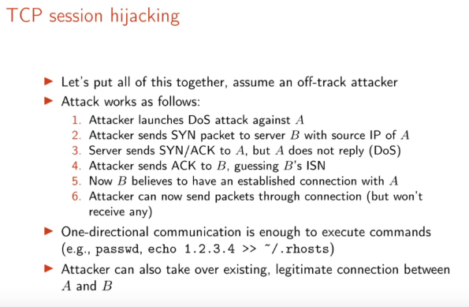
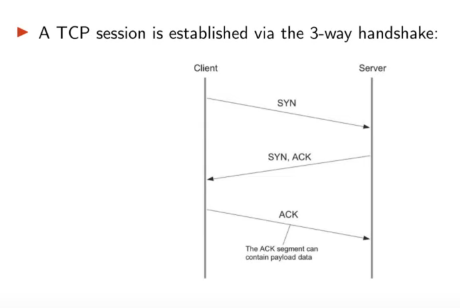

# Assignment 3

## Exercise 1

### a)
Generally means to *Send IP packet with wrong (“spoofed”) source address*.

Problematic if we got a service with **host-based** authentication.

E.g rlogin, rcp, rsh
rlogin:
- **Log** - into remote machine
- **rsh** - run command on remote machine
- **rcp**-  Copy files to remote machi

There is no password required if the IP address is in */etc/hosts.equiv* or *~/.rhosts*

You could echo your IP to ~/.rhosts file and will be able to log in into it.

Now IP spoofing is used in other fields/attacks:

#### DoS attacks.
- Hard/impossible to determine. 
- **floding**: exceeding the *network* capabilities of a network
- **applicaiton-based**: exceeding the processing capabilities
- exception: Slow loris attack.

#### ICMP flooding
- **Ping flooding** - a lot of pings.
- **Ping of death** - weird offset of the packet (ooverflowing the buffer).
- **Teardrop** - overlaping packets (confusing the reciever).
- **Smurf attack** - Flooding using ICMP. Pinging machines and replies go to the victim.  (fix: don't forward broadcasted ping packets or don't reply to broadcasted pings)

#### SYN flooding
 
Host must change sender's IP address field with spoofed IP.

### b)
UDP - because of the checksum.
Checksum is the 16-bit one's complement of the one's complement sum of a pseudo header of information from the IP header, the UDP header, and the data,  padded  with zero octets  at the end (if  necessary)  to  make  amultiple of two octets.

TCP - TCP header follows the internet header, supplying information specific to the TCP protocol.
The checksum field is the 16 bit one's complement of the one's complement sum of all 16 bit words in the header and text.If a segment contains an odd number of header and text octets be checksummed, the last octet is padded on the right zeros to form a 16 bit word for checksum purposes.  The pad is not transmitted as part of the segment.  While computing checksum, the checksum field itself is replaced with zeros.

So we would need to recompute the checksum.

With **SYN-RECV flooding** we want to send more SYN messages than the target is able to discard them from SYN-RECV queue, determined by SYN-RECIEVED timer.

Problem for Mallory would be that he does not recieve the ACK message and you need to create a valid SYN in order to properly attack target (Alice). 
ACK consists also of the correct **ACK number** (server's ISN number + 1), which incerases over time. (1:06 lecture [lecture3](https://youtu.be/Xhm-NWz8kVY?t=3960))

TCP session hijacking is guessing the ISN number.

### c)

SYN would go from Malory to Alice with Bob's IP source address. 

Alice would receive the SYN, save it in queue and send back the ACK to the sender's IP, which is Bob.  
Therefore Malory does not get the SYN ACK with ACK number and can only guess it in order to create a valid ACK. 

### d)
[ICMP_rcf](https://tools.ietf.org/rfc/rfc792.txt)

"ICMP messages are sent in several situations:  for example, when a datagram cannot reach its destination, when the gateway does not have the buffering capacity to forward datagram, and when the gateway can direct the host to send traffic on a shorter route."

So the first part applies to our situation because the host (Ursula) is not reachable. 

"The Internet Protocol is not designed to be absolutely reliable.  The purpose of these control messages is to provide feedback about problems in the communication environment, not to make IP reliable. Some datagrams may still be undelivered without any report of their loss."

"**Destination Address** - 
The address of the gateway or host to which the message should be sent.
"

"If, in the destination host, the IP module cannot deliver the datagram  because the indicated protocol module or process port is not active, the destination host may send a destination unreachable message to the source host."

### e)
If they are in the same Network, Mallory could just use ARP spoofing to do the flood attack against Alice.
If you are in the same broadcast domain, I could just ARP-spoof Bob or the router of Bob and Alice.
(1:09:40 [lecture3](https://youtu.be/Xhm-NWz8kVY?t=4180))

