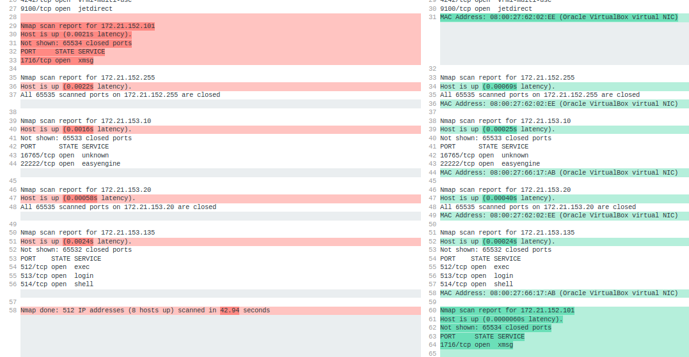

# Assignment 3

## Exercise 3c

For the TCP ports I could use 
1. Scan using TCP connect	nmap -sT 172.21.152.101/23
2. Scan using TCP SYN scan (default)	nmap -sS 172.21.152.101/23

With flag "-p 1-65535" you scan all the ports but it takes 10 times as much time as without it, where it scans 1000 **most commonly used** ports.

```console
kali@netsec-kali:~$ nmap -p 1-65535 172.21.152.101/23
Starting Nmap 7.80 ( https://nmap.org ) at 2020-05-06 15:58 CEST
Nmap scan report for 172.21.152.1
Host is up (0.00068s latency).
Not shown: 65529 closed ports
PORT    STATE    SERVICE
21/tcp  open     ftp
22/tcp  open     ssh
80/tcp  open     http
512/tcp filtered exec
513/tcp filtered login
514/tcp filtered shell

Nmap scan report for 172.21.152.44
Host is up (0.0030s latency).
Not shown: 65532 closed ports
PORT    STATE SERVICE
25/tcp  open  smtp
143/tcp open  imap
993/tcp open  imaps

Nmap scan report for 172.21.152.79
Host is up (0.0046s latency).
Not shown: 65531 closed ports
PORT     STATE SERVICE
79/tcp   open  finger
443/tcp  open  https
4242/tcp open  vrml-multi-use
9100/tcp open  jetdirect

Nmap scan report for 172.21.152.101
Host is up (0.0016s latency).
Not shown: 65534 closed ports
PORT     STATE SERVICE
1716/tcp open  xmsg

Nmap scan report for 172.21.152.255
Host is up (0.00081s latency).
All 65535 scanned ports on 172.21.152.255 are closed

Nmap scan report for 172.21.153.10
Host is up (0.0030s latency).
Not shown: 65533 closed ports
PORT      STATE SERVICE
16765/tcp open  unknown
22222/tcp open  easyengine

Nmap scan report for 172.21.153.20
Host is up (0.0020s latency).
All 65535 scanned ports on 172.21.153.20 are closed

Nmap scan report for 172.21.153.135
Host is up (0.0081s latency).
Not shown: 65532 closed ports
PORT    STATE SERVICE
512/tcp open  exec
513/tcp open  login
514/tcp open  shell

Nmap done: 512 IP addresses (8 hosts up) scanned in 48.02 seconds
```

For the TCP ports I used flag "-sT"

```console
kali@netsec-kali:~$ nmap -p 1-65535 -sT 172.21.152.101/23
Starting Nmap 7.80 ( https://nmap.org ) at 2020-05-06 16:19 CEST
Nmap scan report for 172.21.152.1
Host is up (0.00069s latency).
Not shown: 65529 closed ports
PORT    STATE    SERVICE
21/tcp  open     ftp
22/tcp  open     ssh
80/tcp  open     http
512/tcp filtered exec
513/tcp filtered login
514/tcp filtered shell

Nmap scan report for 172.21.152.44
Host is up (0.0030s latency).
Not shown: 65534 closed ports
PORT   STATE SERVICE
25/tcp open  smtp

Nmap scan report for 172.21.152.79
Host is up (0.0016s latency).
Not shown: 65531 closed ports
PORT     STATE SERVICE
79/tcp   open  finger
443/tcp  open  https
4242/tcp open  vrml-multi-use
9100/tcp open  jetdirect

Nmap scan report for 172.21.152.101
Host is up (0.0021s latency).
Not shown: 65534 closed ports
PORT     STATE SERVICE
1716/tcp open  xmsg

Nmap scan report for 172.21.152.255
Host is up (0.0022s latency).
All 65535 scanned ports on 172.21.152.255 are closed

Nmap scan report for 172.21.153.10
Host is up (0.0016s latency).
Not shown: 65533 closed ports
PORT      STATE SERVICE
16765/tcp open  unknown
22222/tcp open  easyengine

Nmap scan report for 172.21.153.20
Host is up (0.00058s latency).
All 65535 scanned ports on 172.21.153.20 are closed

Nmap scan report for 172.21.153.135
Host is up (0.0024s latency).
Not shown: 65532 closed ports
PORT    STATE SERVICE
512/tcp open  exec
513/tcp open  login
514/tcp open  shell

Nmap done: 512 IP addresses (8 hosts up) scanned in 42.94 seconds
```

Here I got 2 different answers by adding the -p flag. Without it I wouldn't discover the following:

```console 
Nmap scan report for 172.21.152.101	
Host is up (0.0021s latency).	
Not shown: 65534 closed ports	
PORT     STATE SERVICE	
1716/tcp open  xmsg
```
and
```console
Nmap scan report for 172.21.153.10	
Host is up (0.0016s latency).	
Not shown: 65533 closed ports	
PORT      STATE SERVICE	
16765/tcp open  unknown	
22222/tcp open  easyengine
```

because I would just get something like: 

```console
Nmap scan report for 172.21.153.10
Host is up (0.0016s latency).
All 1000 scanned ports on 172.21.153.10 are closed
```

... for the 2nd example.

---

I also tried to scan for with the -sS flag which is connectionless scan but I didn't get all the ports as I did before:

<center>

</center>
(left: -sN flag, right -sS flag)


Other possibilities:
1. **Null scan (-sN)** - Does not set any bits (TCP flag header is 0)
2. **FIN scan (-sF)** - Sets just the TCP FIN bit.
3. **Xmas scan (-sX)** - Sets the FIN, PSH, and URG flags, lighting the packet up like a Christmas tree.

## Exercise 3d
I already got the port 172.21.153.10:2222 as well as :16765
```console
PORT      STATE SERVICE	
22222/tcp open  easyengine
16765/tcp open  unknown	
```

