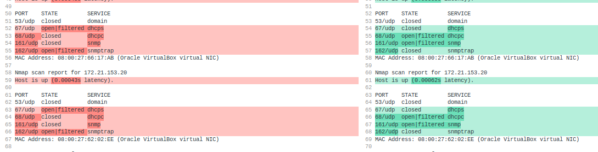

# Assignment 3

## Exercise 3e

from the documentation of nmap:
```js
-sU (UDP scans)
While most popular services on the Internet run over the TCP protocol, UDP[6] services are widely
deployed. DNS, SNMP, and DHCP (registered ports 53, 161/162, and 67/68) are three of the most common.
```
As we can see, we are provided with the most common UDP ports. That's what I will scan:

```js
kali@netsec-kali:~$ sudo nmap -p 53,161,162,67,68 -sU 172.21.152.101/23
Starting Nmap 7.80 ( https://nmap.org ) at 2020-05-06 16:40 CEST
Nmap scan report for 172.21.152.1
Host is up (0.00052s latency).

PORT    STATE         SERVICE
53/udp  closed        domain
67/udp  closed        dhcps
68/udp  open|filtered dhcpc
161/udp closed        snmp
162/udp closed        snmptrap
MAC Address: 08:00:27:AB:03:CB (Oracle VirtualBox virtual NIC)

Nmap scan report for 172.21.152.44
Host is up (0.00048s latency).

PORT    STATE  SERVICE
53/udp  closed domain
67/udp  closed dhcps
68/udp  closed dhcpc
161/udp closed snmp
162/udp closed snmptrap
MAC Address: 08:00:27:66:17:AB (Oracle VirtualBox virtual NIC)

Nmap scan report for 172.21.152.79
Host is up (0.00041s latency).

PORT    STATE  SERVICE
53/udp  closed domain
67/udp  closed dhcps
68/udp  closed dhcpc
161/udp closed snmp
162/udp closed snmptrap
MAC Address: 08:00:27:62:02:EE (Oracle VirtualBox virtual NIC)

Nmap scan report for 172.21.152.255
Host is up (0.00055s latency).

PORT    STATE         SERVICE
53/udp  closed        domain
67/udp  open|filtered dhcps
68/udp  open|filtered dhcpc
161/udp closed        snmp
162/udp open|filtered snmptrap
MAC Address: 08:00:27:62:02:EE (Oracle VirtualBox virtual NIC)

Nmap scan report for 172.21.153.10
Host is up (0.00048s latency).

PORT    STATE         SERVICE
53/udp  closed        domain
67/udp  open|filtered dhcps
68/udp  closed        dhcpc
161/udp closed        snmp
162/udp open|filtered snmptrap
MAC Address: 08:00:27:66:17:AB (Oracle VirtualBox virtual NIC)

Nmap scan report for 172.21.153.20
Host is up (0.00043s latency).

PORT    STATE         SERVICE
53/udp  closed        domain
67/udp  open|filtered dhcps
68/udp  closed        dhcpc
161/udp closed        snmp
162/udp open|filtered snmptrap
MAC Address: 08:00:27:62:02:EE (Oracle VirtualBox virtual NIC)

Nmap scan report for 172.21.153.135
Host is up (0.00052s latency).

PORT    STATE         SERVICE
53/udp  open|filtered domain
67/udp  open|filtered dhcps
68/udp  open|filtered dhcpc
161/udp closed        snmp
162/udp open|filtered snmptrap
MAC Address: 08:00:27:66:17:AB (Oracle VirtualBox virtual NIC)

Nmap scan report for 172.21.152.101
Host is up (0.000026s latency).

PORT    STATE  SERVICE
53/udp  closed domain
67/udp  closed dhcps
68/udp  closed dhcpc
161/udp closed snmp
162/udp closed snmptrap

Nmap done: 512 IP addresses (8 hosts up) scanned in 7.07 seconds
```

`-T5` is the fastest nmap scan and we can use that flag with the udp scan also.

I would get pretty much the same results here, except on some port it would say `closed` and not `open|filtered` and vice versa. 
I do not know why is that...

<center>

</center>

The scan time reduced from 7s to 5s.


```

```
